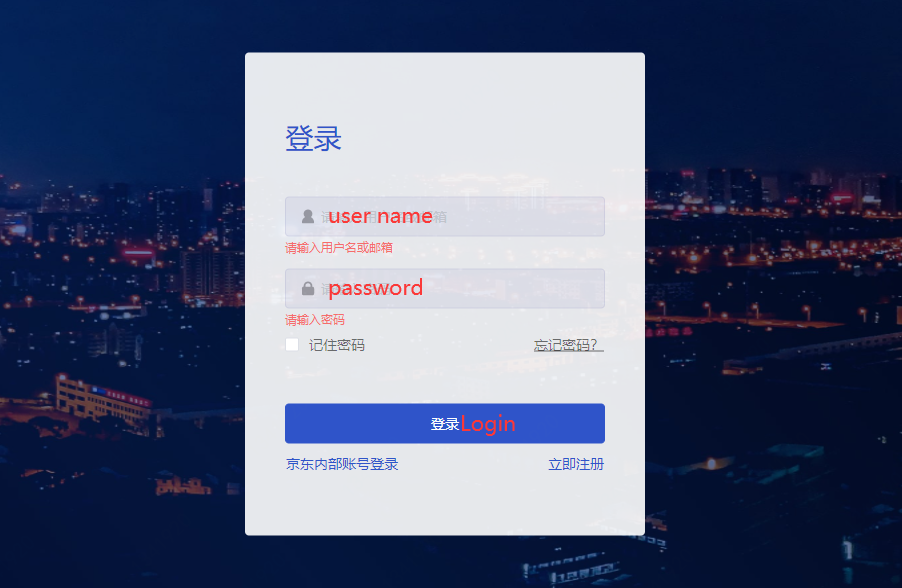
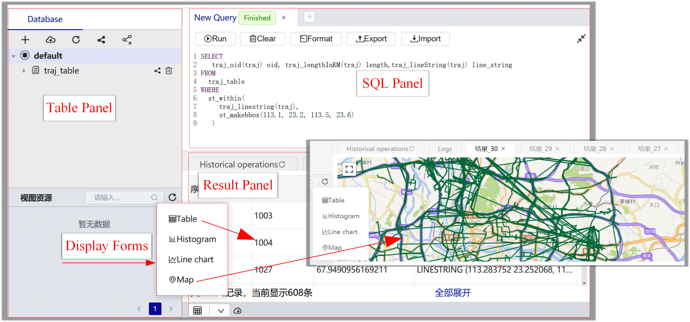
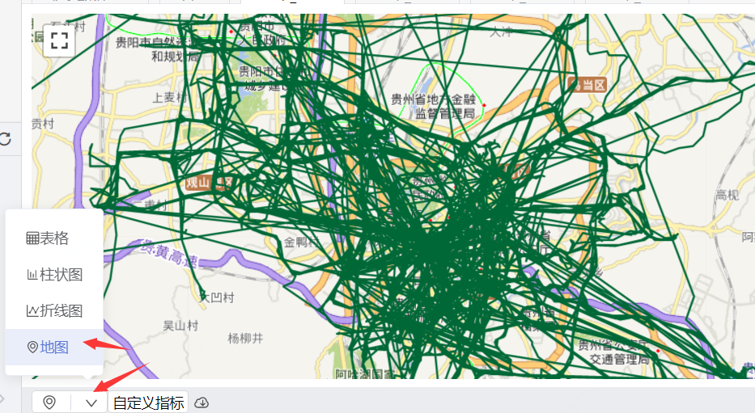
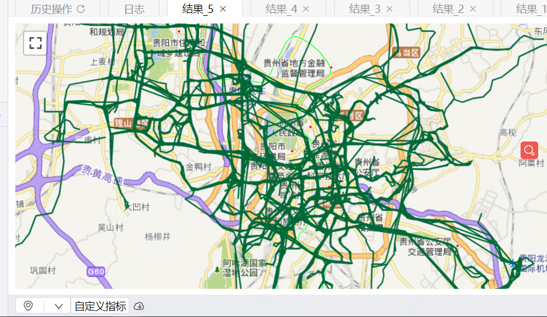

## DEMONSTRATION

<video controls="controls" loop="loop" autoplay="autoplay" src="just-traj.mp4"></video>

## Login

1. We prepare a test account for the reviewers. UserName: icde2020 Password: icde2020!
2. Enter the login page: http://portal-just.urban-computing.cn/login
3. Enter the User Name (icde2020) and Password (icde2020!), then click the button Login, as shown in the following picture.



​                                                                                       Figure 1: Login.

## Web Poral

As shown in Figure 2, the web portal of JUST-Traj has three panels: (1) table panel, which manages the created tables; (2) SQL panel, which provides the SQL editing and execution; and (3) result panel, which visualizes the result by the form of table or map. 



​                                                                       Figure 2: Web portal.

## Create Table

JUST-Traj uses the following statement to create a trajectory table: 

```sql
CREATE TABLE <table name> (<field name> Trajectory)
```

where <field name> is the field name of the trajectory in the database. For example, 

```sql
CREATE TABLE traj_table (traj Trajectory)
```

## Load Data

We can load data from multiple sources into JUST-Traj using the following statement:

```sql
LOAD <source type>:<file path> TO JUST:<table name>
CONFIG {<the field mapping relationship>};
```

where *source type* could be HDFS, HIVE, KAFAK, FLINK, and the *CONFIG* provides the field mapping between the source and the JUST-Traj table. For example, we load data from HDFS to JUST-Traj.

```sql
LOAD HDFS:'/just_tutorial/trajectory_data' to JUST:traj_table (
    oid 0,
    time to_timestamp(3),
    point st_makePoint(1,2)
);            
```

where `/trajectories' is the path of trajectories, lines from 2 to 4 are the field mappings.

## Query

JUST-Traj provides spatial or spatio-temporal queries: e.g., spatial range query, spatio-temporal range query, ID temporal query, kNN query.

- Spatial query

```sql
SELECT * FROM traj_table
WHERE <spatial relationship>(traj, st_makeBBox(lng1,lat1, lng2, lat2);
```

where, *spatial relationship* could be $st\_within$, $st\_intersect$, $st\_overlap$. *st\_makeBBox* is a spatial range formed by two points ($lng1,lat1$) and ($lng2, lat2$). For example,


```sql
select
    traj_linestring(traj) geom
from
    traj_table
where
    st_within(traj_linestring(traj), st_makeBBox(113.0, 23.0, 113.5, 23.6));
```

- Spatio-temporal query


```sql
SELECT * FROM traj_table
WHERE st_within(traj_linestring(traj), st_makeBBox(113.0, 23.0, 113.5, 23.6))
  and traj_startTime(traj) >= '2014-03-13 07:04:51'
  and traj_endTime(traj) <= '2014-03-16 08:04:51';
```

- ID-temporal query


```sql
SELECT * FROM traj_table
WHERE 
  traj_oid(traj) = '1003'
  and traj_startTime(traj) >= '2013-07-03 14:33:27'
  and traj_endTime(traj) <= '2018-08-03 14:33:27'
```

- K-NN query


```sql
SELECT  *FROM  traj_tableWHERE  st_knn(    traj,    'POINT(115.71 39.57)',    'common',    10  )
```

## Analytics

JUST-Traj supports many out-of-the-box analyses on trajectories, which facilitates the development of applications. The SQL statement of DAL is as follows:

```sql
SELECT <analysis operation>(traj, {<parameters>})FROM <table name>
```

where, *analysis operation* is the name of analysis on trajectories, *parameters* set the corresponding parameters. Five common analyses provided by JUST-Traj, i.e.,

**Processing**. Although we can pre-process before storing, the parameter of each algorithm could be adjusted when analyzing. Thus, JUST-Traj also supports the processing in the analytics stage;

(1) Noise Filtering

```sql
SELECT st_trajNoiseFilter(traj,  '{ "maxSpeedMeterPerSecond": 20.0}')FROM  traj_tableLIMIT 1000
```

(2) Segmentation

```sql
SELECT st_trajSegmentation(traj,    '{ "maxTimeIntervalInMinute": 10,      "maxStayDistInMeter": 100,      "minStayTimeInSecond": 100,      "minTrajLengthInKM": 1,      "segmenterType": "HYBRID_SEGMENTER"    }'  )FROM traj_tableLIMIT 1000
```

(3) Interpolation

```sql
SELECT st_freespaceInterpolation(    traj, 30)FROM traj_tableLIMIT 100
```

(4) MapMatching

create a trajectory table for MapMatching

```sql
CREATE TABLE mm_traj (traj Trajectory);LOAD hdfs: '/just_ci_data/mm_traj.csv' to just: mm_traj( traj traj_recover(traj))WITH ("just.separator"="|","just.header"="true")
```

create a road network table

```sql
create table if not exists longgang_expand_rn (  road RoadSegment,  weight Double);LOAD hdfs: '/just_ci_data/longgang_expand_rn.csv' to just: longgang_expand_rn (          oid oid,          geom st_lineFromText(geom),          direction direction,          level level,          speed_limit speed_limit,          weight weight) WITH ("just.separator"="|","just.header"="true")
```

MapMatching

ST_trajMapMatchToProjection 

```sql
select  ST_trajMapMatchToProjection( t1.traj,t2.t )from mm_traj t1, (select ST_makeRoadNetwork(collect_list(road))as t FROM longgang_expand_rn) as t2
```

ST_trajMapMatchToRoute

```sql
SELECT  st_trajMapMatchToRoute(    t1.traj,    t2.t  )FROM  mm_traj t1, (SELECT st_makeRoadNetwork(collect_list(road))as t FROM longgang_expand_rn) AS t2;
```

**Aggregation**. JUST-Traj provides many aggregation operations, e.g., $max()$, $min()$, $count()$; For example,

```sql
SELECT count(*) FROM traj_table;
```

**Stay Point Detection.** Moving objects tend to stay due to certain events, such as vehicles staying for refueling, couriers staying for delivery. By analyzing the place that a mobile object stays, we can infer to some places of interesting, e.g., the delivery address;

```sql
SELECT st_trajStayPoint(traj,  '{ "maxStayDistInMeter": 10,     "minStayTimeInSecond": 60}')FROM  traj_tableLIMIT 1000
```

## Holistic Solutions

**Spatio-temporal Query and Stay Point Detection** 
In this scenario, we detect stay points from the spatio-temporal query result. We define the location where the lorry stays over a given time threshold (*minStayTimeInSecond*) as a stay point, where the location is a spatial region whose maximum distance not greater than a distance threshold (*maxStayDisInMeter*). The underlying locations of stay points could be the delivery addresses. The SQL is as follows:

```sql
SELECT st_trajStayPoint(traj,  '{ "maxStayDistInMeter": 10,     "minStayTimeInSecond": 60}')FROM  traj_tableWHERE  st_within(traj_linestring(traj),       st_makeBBox(113.0, 23.0, 113.5, 23.6))  and traj_startTime(traj) >= '2014-03-13 07:04:51'  and traj_endTime(traj) <= '2014-03-16 08:04:51'
```

Lines from 7 to 10 take a spatio-temporal range to query trajectories from the database. Lines from 1 to 3 execute the *Stay Point Detection* operation on the extracted trajectories, where lines from 2 to 3 are parameters of *Stay Point Detection*. 

**ID Temporal Query and Noise Filtering**

In this scenario, we define the point whose speed exceeds the maximum limited speed (*maxSpeedMeterPerSecond*) as the noise point, and we filter that point. The SQL is as follows:

LOADING trajectories of Guiyang:

```sql
LOAD HDFS :'/just_tutorial/guiyang_traj' to JUST :traj_table (   oid 1,   time to_timestamp(0),   point st_makePoint(3, 2) )
```

The raw trajectory

```sql
SELECT  traj_linestring(traj)FROM  traj_tableWHERE  traj_oid(traj) = '1197404443';
```



<center>Figure 3: The raw trajectory of '1192408782'.</center>

Noise Filtering

```sql
SELECT  traj_linestring(aa.item)from  (    SELECT      st_trajnoisefilter(        traj,        '{ "@type": "COMPLEX_FILTER",      "maxSpeedMeterPerSecond": 20.0,      "segmenterParams": { "maxTimeIntervalInMinute": 10,      "maxStayDistInMeter": 100,      "minStayTimeInSecond": 100,      "minTrajLengthInKM": 1,      "segmenterType": "ST_DENSITY_SEGMENTER"}}'      )    FROM      traj_table    WHERE      traj_oid(traj) = '1192408782'  and traj_startTime(traj) >= '2018-06-03 14:33:27'  and traj_endTime(traj) <= '2018-08-03 14:33:27'  ) as aa
```

Lines from 7 to 9 take a *ID Temporal* query to extract trajectories from the database. Lines from 1 to 3 execute the *Noise Filtering* operation on the extracted trajectories.



<center>Figure 3: Cleaned Trajectories of '1192408782'.</center>

